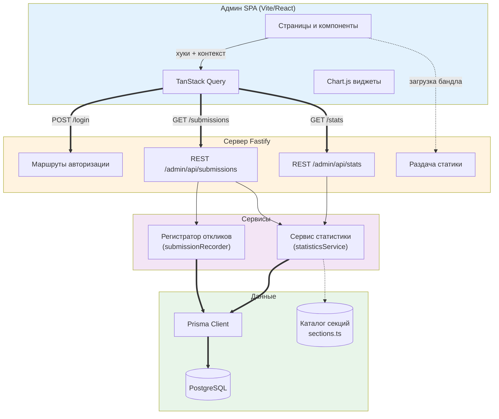
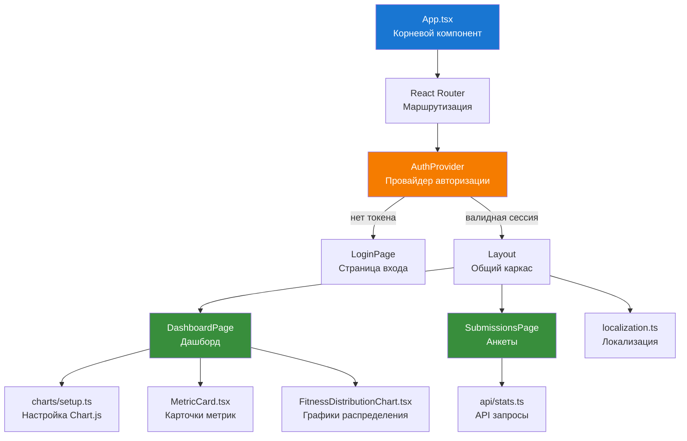
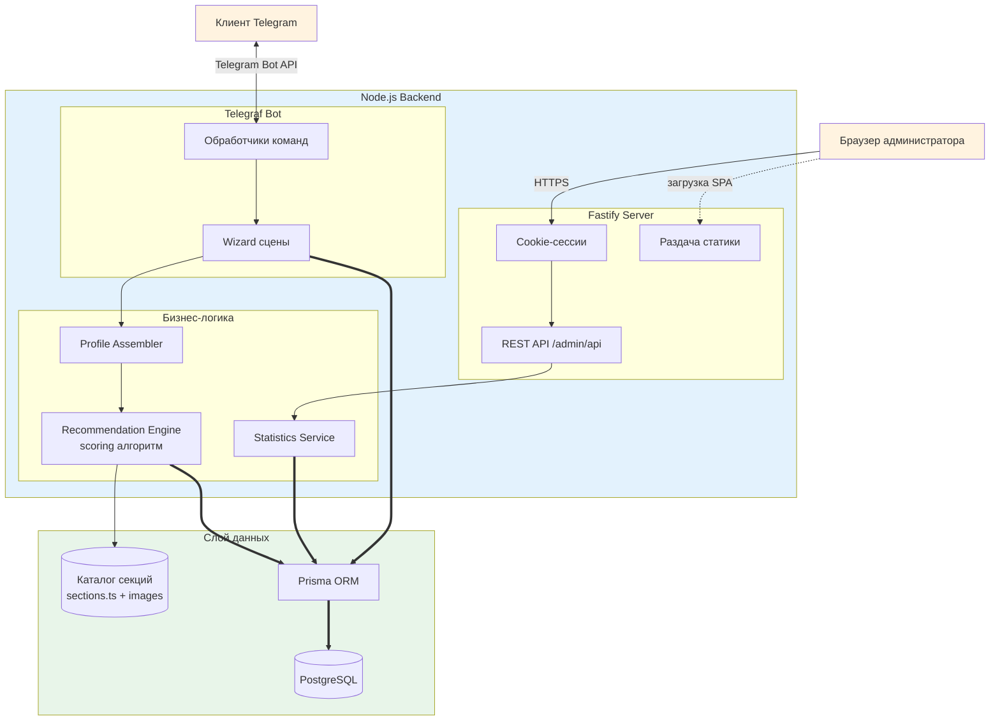
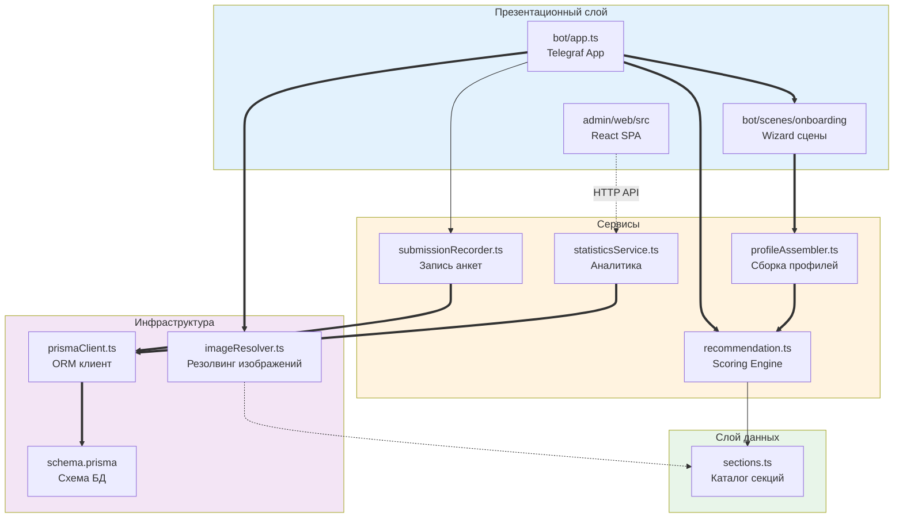
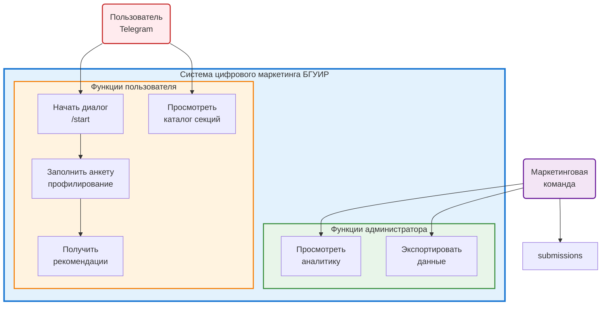
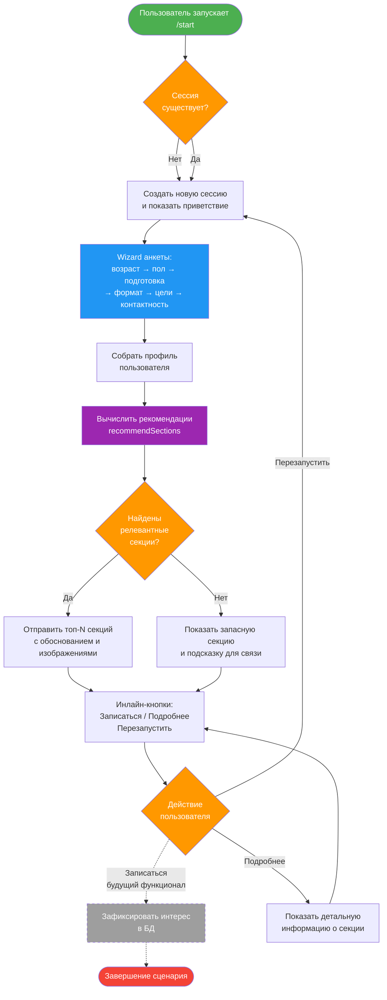
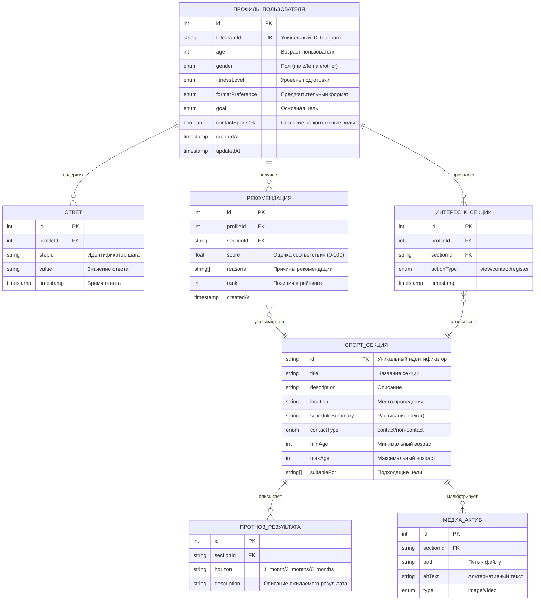

# Прототип системы цифрового маркетинга образовательно-спортивных услуг БГУИР

## Содержание

| Раздел                                                                | Описание                                             |
| --------------------------------------------------------------------- | ---------------------------------------------------- |
| [Введение](#введение)                                                 | Контекст создания прототипа и задачи проекта         |
| [Основные функции бота](#основные-функции-бота)                       | Ключевые пользовательские и операционные возможности |
| [Основные функции веб-панели](#основные-функции-веб-панели)           | Возможности админской аналитики и управления         |
| [Архитектура веб-панели](#архитектура-веб-панели)                     | Структура SPA, Fastify-API и взаимодействие модулей  |
| [Хранилище данных](#хранилище-данных)                                 | Архитектура и использование базы данных              |
| [Архитектура решения](#архитектура-решения)                           | Взаимодействие компонентов бота, API и веб-панели    |
| [Структура кода](#структура-кода)                                     | Логическое разделение модулей и зависимостей         |
| [Диаграммы чат-бота](#диаграммы-чат-бота)                             | Варианты использования, бизнес-процесс и ER-логика   |
| [Подробное описание функций](#подробное-описание-функций)             | Расширенный обзор пользовательских сценариев         |
| [Техническая документация](#техническая-документация)                 | Архитектура, файловая структура, технологии          |
| [Установка и запуск](#установка-и-запуск)                             | Настройка окружения и сценарии запуска               |
| [Тестирование и контроль качества](#тестирование-и-контроль-качества) | Набор автоматических и ручных проверок               |
| [Планы развития](#планы-развития)                                     | Идеи для расширения и внедрения                      |

## Введение

Прототип системы цифрового маркетинга образовательно-спортивных услуг БГУИР — это чат-бот в Telegram, который помогает абитуриентам, студентам и сотрудникам подобрать подходящие спортивные секции, понять ожидаемую динамику прогресса и быстро связаться с организаторами. Бот сочетает маркетинговый подход (акцент на ценностях и результатах) и персонализированную аналитику (учёт анамнеза, целей, предпочтений по формату занятий).

## Основные функции бота

- **Интерактивная анкета**: пошаговый wizard для сбора профиля пользователя (возраст, пол, физподготовка, цели, предпочтения).
- **Персонализированные рекомендации**: алгоритм scoring на основе соответствия параметров пользователя и характеристик секций.
- **Визуальное представление**: карточки секций с изображениями, прогнозами результатов и обоснованием выбора.
- **Каталог секций**: команда `/sections` для просмотра всех доступных направлений с фильтрацией.
- **Обработка интереса**: фиксация действий пользователя (просмотр, запись, обратная связь) для аналитики.

## Основные функции веб-панели

- **Дашборд аналитики**: главная страница отображает ключевые KPI — количество анкет, динамику вовлечённости, распределение по полу, возрасту, уровню подготовки и целям.
- **Просмотр анкет**: таблица откликов позволяет искать, фильтровать и раскрывать профиль каждого пользователя вместе с рекомендациями и обоснованиями.
- **Статистика по секциям**: диаграммы показывают популярность направлений и долю контактных/неконтактных видов спорта на основе собранных данных.
- **Интеграция с ботом**: все графики и таблицы обновляются в реальном времени благодаря REST API `/admin/api`, которые подтягивают свежие ответы и расчётные показатели.

## Архитектура веб-панели

### Архитектура и потоки данных

SPA общается с Fastify API через защищённые cookie-сессии и CSRF-токены, а API агрегирует статистику на основе Prisma и кеша в памяти.



### Логика клиентского приложения



### Ключевые файлы SPA

| Путь                                      | Назначение                                                                    |
| ----------------------------------------- | ----------------------------------------------------------------------------- |
| `admin/web/src/main.tsx`                  | Точка входа Vite, монтирует `App` и подключает провайдеры TanStack Query      |
| `admin/web/src/App.tsx`                   | Объявляет маршруты, глобальные контексты и guard авторизации                  |
| `admin/web/src/auth/AuthProvider.tsx`     | Управляет состоянием сессии, проверяет логин, прокидывает методы входа/выхода |
| `admin/web/src/pages/DashboardPage.tsx`   | Рендер KPI, диаграммы и карточки метрик на основе статистики                  |
| `admin/web/src/pages/SubmissionsPage.tsx` | Отображает таблицу заполненных анкет с фильтрами и детализацией               |
| `admin/web/src/api/client.ts`             | HTTP-клиент с настройкой baseURL, cookie и обработкой ошибок                  |
| `admin/web/src/api/stats.ts`              | Хуки TanStack Query для получения агрегатов и списка анкет                    |
| `admin/web/src/components/Layout.tsx`     | Общий каркас, навигация и shell приложения                                    |
| `admin/web/src/charts/setup.ts`           | Инициализация Chart.js, регистрация плагинов и общих опций                    |

### Технологический стек веб-панели

- **React 18 + TypeScript** для компонентного UI и типовой безопасности.
- **Vite** как dev-сервер и сборщик, даёт HMR и быстрые билды.
- **TanStack Query** для управления асинхронными запросами и кэширования данных.
- **React Router** для client-side навигации между страницами панели.
- **Chart.js + chartjs-adapter-date-fns** для визуализации показателей.
- **Fastify + @fastify/static + @fastify/cookie** для раздачи бандла, API и авторизации.
- **Prisma** в качестве DAL между API и PostgreSQL.

## Хранилище данных

- **PostgreSQL + Prisma**: структура базы данных описана в `prisma/schema.prisma`; миграции позволяют синхронизировать схему между окружениями.
- **Сущности**: база хранит профили пользователей, их ответы по шагам анкеты, рассчитанные рекомендации и журналы взаимодействий с секциями.
- **Связь с приложением**: бот записывает заполненные анкеты через `SubmissionRecorder`, а админ-панель читает агрегированные срезы через `statisticsService`.
- **Миграции и деплой**: команда `npx prisma migrate deploy` применяется при раскатке на новый стенд, гарантируя согласованность схемы.
- **Переменные окружения**: строка подключения `DATABASE_URL` задаётся в `.env`; секретные данные не хранятся в репозитории и должны управляться через защищённые секреты.

## Архитектура решения

- **Коммуникация**: Telegram-пользователи взаимодействуют с ботом через Telegraf, а маркетинговая команда использует веб-панель; оба слоя работают поверх единого Fastify-приложения.
- **Данные**: рекомендательный движок читает статический каталог и дополнительно сохраняет результаты в PostgreSQL через Prisma для аналитики.
- **Интерфейсы**: REST API `/admin/api` обслуживает SPA, а бот получает апдейты и отправляет ответы, используя общие сервисы и форматтеры.



**Легенда:**

- `==>` Основные потоки данных (критичные)
- `-->` Синхронные вызовы
- `<-->` Двусторонняя коммуникация
- `-.->` Загрузка статических ресурсов

### Развёртывание

Один Node.js процесс обслуживает и бота, и API; статика админ-панели раздаётся Fastify, а база может быть общедоступной или управляемой через облако.

## Структура кода

- **Слои приложения**: код разделён на пользовательский интерфейс (бот и веб-панель), доменную логику (рекомендации, профили), инфраструктуру (Prisma) и сервисы (статистика, сбор данных).
- **Модули**: `src/bot` содержит сцены и утилиты Telegraf, `src/admin` — HTTP-сервер и API, `src/services` и `src/domain` инкапсулируют бизнес-логику, `prisma/` управляет схемой данных.
- **Повторное использование**: общие типы и функции импортируются через `src/types.ts` и `profileDefaults.ts`, обеспечивая согласованность между ботом и админкой.



**Зависимости:** Визуальная схема показывает, как Telegraf сцены используют сервисы для сборки профиля и рекомендаций, а админ-панель опирается на статистический сервис, который агрегирует данные из той же инфраструктуры.

## Диаграммы чат-бота

### Диаграмма вариантов использования



**Расшифровка:** Пользователь Telegram инициирует диалог, проходит профилирование и получает рекомендации; маркетинговая команда использует административные функции для анализа и экспорта данных.

### Бизнес-процесс взаимодействия



**Расшифровка:** При запуске бота проверяется наличие сессии и заполненного профиля. Если профиль есть, пользователь может продолжить с ним или перезапустить. После заполнения анкеты движок рекомендаций подбирает секции, а пользователь взаимодействует с результатами через инлайн-кнопки.

### Логическая диаграмма сущность-связь



**Расшифровка:**

- Один профиль может иметь много ответов, рекомендаций и интересов к секциям
- Каждая рекомендация и интерес привязаны к конкретной спортивной секции
- Секции имеют множественные прогнозы результатов и медиа-активы
- Добавлена сущность `ИНТЕРЕС_К_СЕКЦИИ` для отслеживания взаимодействий пользователя

## Подробное описание функций

- **Анкета «Знакомство»**: вступительная сцена объясняет возможности бота и подготавливает пользователя к опросу, используя дружественные подсказки.
- **Выбор возрастной группы**: шаг `ageSelectionStep` применяет динамические клавиатуры и проверяет корректность ввода; результаты влияют на фильтрацию секций с возрастными ограничениями.
- **Определение пола**: шаг `genderStep` уточняет приоритетные секции и используется в текстах рекомендаций.
- **Оценка физподготовки**: `fitnessStep` предлагает шкалу уровней подготовки и учёт прошлых занятий, что изменяет базовый коэффициент в `computeScore`.
- **Формат занятий**: `formatStep` фиксирует предпочтение очного, гибридного или самостоятельного режима, повышая релевантность секций с совпадающим расписанием.
- **Целеполагание**: `goalStep` определяет ключевой ожидаемый результат (здоровье, соревнования, дисциплина, коммуникация), формирующий текстовые обоснования.
- **Контактность**: `competitionInterestStep` и `contactPreferenceStep` проверяют готовность к контактным направлениям, исключая неподходящие секции.
- **Выдача рекомендаций**: `recommendSections` вычисляет итоговый рейтинг, подбирает изображения, формирует MarkdownV2-представление и отправляет блок карточек с кнопками для навигации.
- **Команда `/sections`**: обработчик `src/bot/handlers/sections.ts` выводит полный каталог секций с базовой информацией, доступный независимо от завершения анкеты.
- **Защита от ошибок**: middleware `safeHandler` и адаптеры `replyMarkdownV2Safe`/`replyWithPhotoMarkdownV2Safe` гарантируют корректный fallback в случае проблем с форматированием или отсутствием изображений.

## Техническая документация

### Архитектурный обзор

- **Интерфейс взаимодействия** — Telegram бот на Telegraf WizardScene управляет многошаговыми сценариями и безопасной отправкой сообщений.
- **Доменная логика** — модуль `src/recommendation.ts` со scoring-движком и причинными объяснениями поверх статического каталога.
- **Каталог** — статические данные секций (`src/data/sections.ts`) с изображениями, прогнозами результатов и атрибутами отбора.
- **Админ-HTTP слой** — Fastify-сервер (`src/admin`) с сессиями, CSRF-защитой, статикой Vite и REST API под `/admin/api`.
- **Хранилище** — PostgreSQL + Prisma (`prisma/schema.prisma`, `src/infrastructure/prismaClient.ts`) для сохранения анкет и рекомендаций.
- **Админ-UI** — одностраничное приложение на React/Vite (`admin/web`) с TanStack Query и Chart.js для дашборда.
- **Инфраструктура** — Node.js 18 (ESM), TypeScript, `tsx` для запуска в dev, `tsc` и `vite build` для сборки, деплой на Heroku.
- **Сессии** — в памяти Telegraf для бота и cookie-based Fastify session для админ-панели.

### Структура проекта

#### Backend (src/)

```text
src/
├── bot/              # Telegram бот (Telegraf)
│   ├── scenes/       # Онбординг-сценарии
│   ├── handlers/     # Команды и действия
│   └── services/     # Резолвинг изображений
├── admin/            # REST API для админки (Fastify)
│   ├── routes/       # Эндпоинты
│   └── services/     # Статистика
├── services/         # Бизнес-логика
├── data/             # Каталог секций + изображения
├── infrastructure/   # Prisma, DB
└── recommendation.ts # Алгоритм подбора
```

#### Frontend (admin/web/)

```text
admin/web/src/
├── pages/         # Страницы админки
├── components/    # UI компоненты
└── api/           # HTTP клиент
```

#### Database (prisma/)

```text
prisma/
├── schema.prisma  # Модели данных
└── migrations/    # История миграций
```

### Назначение ключевых файлов и модулей

#### Бот (Telegram)

| Путь                                      | Назначение                                                                                              |
| ----------------------------------------- | ------------------------------------------------------------------------------------------------------- |
| `src/index.ts`                            | Точка входа: загрузка `.env`, запуск Telegraf, регистрация сцен и middleware                            |
| `src/recommendation.ts`                   | Алгоритм расчёта рейтинга секций, набор эвристик, fallback-логика                                       |
| `src/types.ts`                            | Определения типов: `UserProfile`, `SportSection`, `RecommendationResult` и вспомогательные перечисления |
| `src/data/sections.ts`                    | Каталог секций с описанием, локацией, расписанием, прогнозами результатов и изображениями               |
| `src/bot/app.ts`                          | Конфигурация Telegraf, подключение сцен, общие middlewares                                              |
| `src/bot/constants.ts`                    | Константы проекта (префиксы callback-данных, лимиты рекомендаций)                                       |
| `src/bot/formatters.ts`                   | Утилиты MarkdownV2, форматирование карточек рекомендаций                                                |
| `src/bot/keyboards.ts`                    | Генераторы inline-клавиатур и раскладок для шагов анкеты                                                |
| `src/bot/session.ts`                      | Структура и helpers работы с сессией (`ensureProfile`, `ensureTemp`)                                    |
| `src/bot/telegram.ts`                     | Безопасные методы отправки сообщений/фото с fallback на plain text                                      |
| `src/bot/handlers/commands.ts`            | Регистрация команд `/start`, `/sections`                                                                |
| `src/bot/handlers/sections.ts`            | Рендер каталога секций и обработка инлайн-навигации                                                     |
| `src/bot/scenes/onboarding.ts`            | Центральная сцена-оркестратор анкеты                                                                    |
| `src/bot/scenes/onboarding/steps/*.ts`    | Модули, описывающие отдельные шаги Wizard-сцены                                                         |
| `src/bot/scenes/onboarding/prompts.ts`    | Текстовые шаблоны и подсказки для шагов                                                                 |
| `src/bot/scenes/onboarding/helpers.ts`    | Общие функции для работы сцен (например, `sendPromptMessage`)                                           |
| `src/bot/services/imageResolver.ts`       | Нахождение файлов изображений в dev/prod среде                                                          |
| `src/bot/utils/safeHandler.ts`            | Обёртка для ловли исключений внутри Telegraf-хэндлеров                                                  |
| `src/domain/profileDefaults.ts`           | Значения профиля по умолчанию и базовые веса                                                            |
| `src/services/profileAssembler.ts`        | Компоновка пользовательских ответов в `UserProfile`                                                     |
| `src/services/submissionRecorder.ts`      | Сохранение заполненных анкет и рекомендаций в базе данных                                               |
| `src/admin/server.ts`                     | Fastify-приложение с конфигурацией сессий, статикой и подключением REST-маршрутов                       |
| `src/admin/services/statisticsService.ts` | Агрегация статистики и выборка анкет для админ-панели                                                   |
| `src/admin/routes/*.ts`                   | REST-эндпойнты `/admin/api` для авторизации, статистики и списка анкет                                  |
| `prisma/schema.prisma`                    | Схема базы данных Prisma (PostgreSQL) для хранения опросов и рекомендаций                               |
| `test/*.test.ts`                          | Набор Jest-тестов для рекомендаций и сценариев онбординга                                               |

#### Админ: web (frontend)

| Путь (admin/web/src)               | Назначение                                                                          |
| ---------------------------------- | ----------------------------------------------------------------------------------- |
| `main.tsx`                         | Точка монтирования SPA; настраивает TanStack Query, роутер и провайдеры приложения. |
| `App.tsx`                          | Маршрутизация, layout и общая оболочка приложения (AuthGuard, навигация).           |
| `localization.ts`                  | Файлы локализации/строки интерфейса и вспомогательные функции переводов.            |
| `api/client.ts`                    | HTTP-клиент с настройкой baseURL, cookie и обработкой ошибок для REST-запросов.     |
| `api/auth.ts`                      | Хуки/утилиты для аутентификации администраторов (login/logout).                     |
| `api/stats.ts`                     | Хуки TanStack Query для получения агрегатов статистики и списка анкет.              |
| `pages/DashboardPage.tsx`          | Дашборд: KPI и диаграммы (Chart.js) для аналитики анкет и вовлечённости.            |
| `pages/LoginPage.tsx`              | Страница входа для администраторов с формой и обработкой ошибок.                    |
| `pages/SubmissionsPage.tsx`        | Список анкет: таблица, фильтры и подробный просмотр профилей/рекомендаций.          |
| `components/Layout.tsx`            | Общая структура страниц: шапка, навигация и контейнер содержимого.                  |
| `components/MetricCard.tsx`        | Визуальные карточки метрик для KPI (числа, тренды).                                 |
| `components/FullscreenSpinner.tsx` | Компонент-заглушка для ожидания загрузки (полноэкранный спиннер).                   |
| `components/TimelineChart.tsx`     | Компонент диаграммы временных рядов (использует Chart.js адаптеры).                 |
| `charts/setup.ts`                  | Инициализация Chart.js, регистрация адаптеров и общих опций графиков.               |
| `auth/AuthProvider.tsx`            | Провайдер контекста аутентификации, хранит состояние сессии администратора.         |
| `styles.css`                       | Базовые стили приложения и переменные темы.                                         |

### Технологический стек

- **Node.js 18 + ES Modules** — основная платформа исполнения и сборки.
- **TypeScript** — статическая типизация, NodeNext-модули для корректных `.js` импортов.
- **Telegraf** — фреймворк для Telegram-ботов с поддержкой сцен и middleware.
- **Fastify** — HTTP-сервер для админ-панели с сессиями, CSRF и статикой.
- **Prisma + PostgreSQL** — слой данных для хранения ответов опросов и рекомендаций.
- **React + Vite + TanStack Query + Chart.js** — SPA-дэшборд для визуализации статистики.
- **Jest** — модульные тесты для рекомендаций и сценариев опроса.
- **tsx** — быстрый запуск TypeScript без предварительной компиляции в режиме разработки.
- **dotenv** — загрузка токена бота и других секретов из `.env`.

## Установка и запуск

### 1. Клонирование и установка зависимостей

```powershell
cd d:\projects\bsuir
npm install
```

### 2. Настройка переменных окружения

```powershell
Copy-Item .env.example .env
```

Обязательно заполните:

- `BOT_TOKEN` – токен бота из BotFather
- `DATABASE_URL` – строка подключения к PostgreSQL
- `ADMIN_USERNAME` – логин для панели
- `ADMIN_PASSWORD` – пароль (хэш будет подсчитан автоматически)
  или `ADMIN_PASSWORD_HASH` – заранее подготовленный Argon2-хэш
- `ADMIN_SESSION_SECRET` – секрет с длиной >= 32 символа

### 3. Применение миграций базы данных

Один раз на окружение:

```powershell
npx prisma migrate deploy
```

### 4. Разработка

**API + бот:**

```powershell
npm run dev
```

Telegraf + Fastify на http://localhost:3000

**UI:**

```powershell
npm run dev:admin
```

Vite dev-server на http://localhost:5173 с прокси на API

### 5. Сборка и продакшен-запуск

```powershell
npm run build   # vite build + tsc
npm start       # запускает бота и Fastify-сервер
```

### 6. Проверка типов

```powershell
npx tsc --noEmit
```

> ⚠️ **Важно:** Токен бота храните конфиденциально. В случае утечки немедленно перевыпустите его через BotFather и обновите `.env`.

## Тестирование и контроль качества

### Автоматические тесты

```powershell
npm test
```

Выполняет Jest-спеки:

- `recommendation.test.ts` и `recommendation.cover.test.ts` — проверка корректности алгоритма scoring
- `onboarding.*.test.ts` — подтверждение сценариев Wizard-а

### Статический анализ

```powershell
npx tsc --noEmit
```

Предотвращает типовые несоответствия и ошибочные импорты.

### Ручное тестирование

Полный сценарий проверки:

1. `/start` → заполнение анкеты
2. Получение рекомендаций с изображениями
3. Просмотр `/sections`
4. Нажатие инлайн-кнопок (записаться, подробнее)
5. Проверка админ-панели (логин, дашборд, анкеты)

### Верификация ассетов

Убедитесь, что:

- Изображения секций находятся в `src/data/images`
- `imageResolver` корректно находит их в dev и prod окружениях
- Все пути в `sections.ts` актуальны

## Планы развития

### Краткосрочные (Q1-Q2 2025)

- **Интеграция CRM**: передача профилей в систему лид-менеджмента для отслеживания конверсии в записи
- **Поддержка многоязычности**: перевод интерфейса и контента на английский/белорусский языки
- **Расширение аналитики**: когортный анализ, воронка конверсии, A/B тесты

### Среднесрочные (Q3-Q4 2025)

- **Расширение каталога**: динамическая загрузка расписаний, стоимости и наличия мест из внешних источников
- **Интеграция оплаты**: оформление записи и предоплаты прямо в чат-боте
- **Система уведомлений**: напоминания о занятиях, достижениях, акциях

### Долгосрочные (2026+)

- **AI-ассистент**: интеграция GPT для консультаций по тренировкам
- **Мобильное приложение**: нативные iOS/Android клиенты
- **Геймификация**: система достижений, рейтинги, челленджи

---
