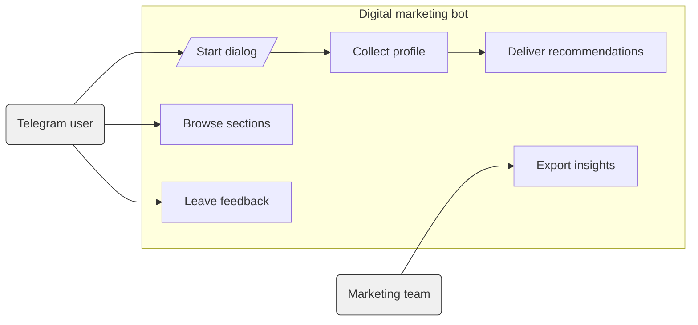
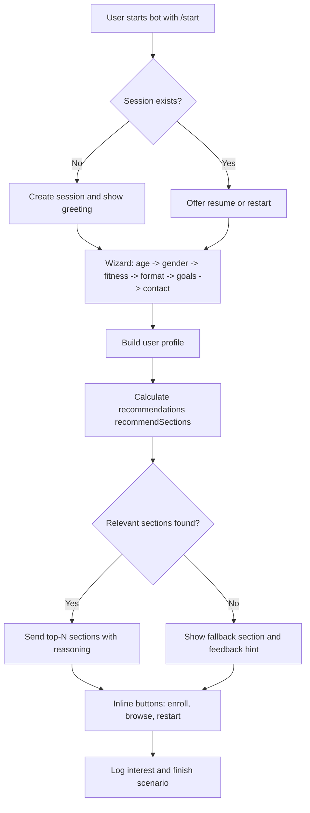
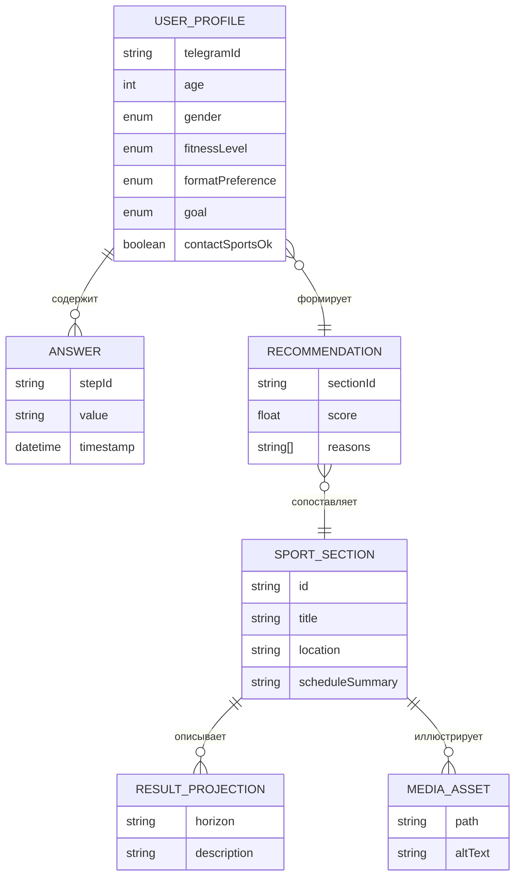

# Прототип системы цифрового маркетинга образовательно-спортивных услуг БГУИР

## Содержание

| Раздел                                                                | Описание                                             |
| --------------------------------------------------------------------- | ---------------------------------------------------- |
| [Введение](#введение)                                                 | Контекст создания прототипа и задачи проекта         |
| [Основные функции бота](#основные-функции-бота)                       | Ключевые пользовательские и операционные возможности |
| [Диаграммы чат-бота](#диаграммы-чат-бота)                             | Варианты использования, бизнес-процесс и ER-логика   |
| [Подробное описание функций](#подробное-описание-функций)             | Расширенный обзор пользовательских сценариев         |
| [Техническая документация](#техническая-документация)                 | Архитектура, файловая структура, технологии          |
| [Установка и запуск](#установка-и-запуск)                             | Настройка окружения и сценарии запуска               |
| [Тестирование и контроль качества](#тестирование-и-контроль-качества) | Набор автоматических и ручных проверок               |
| [Планы развития](#планы-развития)                                     | Идеи для расширения и внедрения                      |

## Введение

Прототип системы цифрового маркетинга образовательно-спортивных услуг БГУИР — это чат-бот в Telegram, который помогает абитуриентам, студентам и сотрудникам подобрать подходящие спортивные секции, понять ожидаемую динамику прогресса и быстро связаться с организаторами. Бот сочетает маркетинговый подход (акцент на ценностях и результатах) и персонализированную аналитику (учёт анамнеза, целей, предпочтений по формату занятий).

Цель прототипа:

- собрать требования и проверить гипотезу о спросе на digital-консьерж для спортивных программ БГУИР;
- предложить персональные рекомендации по секциям, снизив барьер входа и повысив конверсию в записи;
- предоставить маркетинговой команде структурированные данные о заинтересованности и профиле аудитории.

## Основные функции бота

- **Интерактивное анкетирование**: последовательный Wizard-процесс собирает возраст, пол, уровень физической подготовки, желаемый формат тренировок, цели и готовность к контактным видам спорта.
- **Персонализированные рекомендации**: движок правил рассчитывает наиболее релевантные секции, обосновывает выбор и предлагает прогноз достижимых результатов на горизонты 1, 3 и 6+ месяцев.
- **Обзор каталога секций**: команда `/sections` выводит галерею с кратким описанием и преимуществами каждой секции, включая изображения и контактную информацию.
- **Гибкий UX**: кнопки-инлайн облегчают выбор ответов, а безопасные обработчики взаимодействий защищают от ошибок Telegram API.
- **Маркетинговые инсайты**: формирование профиля пользователя на основе ответов облегчает последующую сегментацию аудитории и планирование коммуникаций.

## Диаграммы чат-бота

### Диаграмма вариантов использования



**Расшифровка:** Пользователь Telegram инициирует диалог, проходит сбор профиля и получает рекомендации; маркетинговая команда использует экспорт интересов.

### Бизнес-процесс взаимодействия



**Расшифровка:** Пользователь запускает бота, заполняет анкету, после чего движок рекомендаций выбирает секции; далее пользователь взаимодействует с кнопками, а система фиксирует интерес.

### Логическая диаграмма сущность-связь



**Расшифровка:** Профиль пользователя связан с ответами и рекомендациями; рекомендации привязаны к секциям, для которых описаны прогнозы результатов и медиаматериалы.

## Подробное описание функций

- **Анкета «Знакомство»**: вступительная сцена объясняет возможности бота и подготавливает пользователя к опросу, используя дружественные подсказки.
- **Выбор возрастной группы**: шаг `ageSelectionStep` применяет динамические клавиатуры и проверяет корректность ввода; результаты влияют на фильтрацию секций с возрастными ограничениями.
- **Определение пола**: шаг `genderStep` уточняет приоритетные секции и используется в текстах рекомендаций.
- **Оценка физподготовки**: `fitnessStep` предлагает шкалу уровней подготовки и учёт прошлых занятий, что изменяет базовый коэффициент в `computeScore`.
- **Формат занятий**: `formatStep` фиксирует предпочтение очного, гибридного или самостоятельного режима, повышая релевантность секций с совпадающим расписанием.
- **Целеполагание**: `goalStep` определяет ключевой ожидаемый результат (здоровье, соревнования, дисциплина, коммуникация), формирующий текстовые обоснования.
- **Контактность**: `competitionInterestStep` и `contactPreferenceStep` проверяют готовность к контактным направлениям, исключая неподходящие секции.
- **Выдача рекомендаций**: `recommendSections` вычисляет итоговый рейтинг, подбирает изображения, формирует MarkdownV2-представление и отправляет блок карточек с кнопками для навигации.
- **Команда `/sections`**: обработчик `src/bot/handlers/sections.ts` выводит полный каталог секций с базовой информацией, доступный независимо от завершения анкеты.
- **Перезапуск `/restart`**: очищает сессию, что позволяет пользователю оперативно изменить ответы (актуально при смене целей).
- **Защита от ошибок**: middleware `safeHandler` и адаптеры `replyMarkdownV2Safe`/`replyWithPhotoMarkdownV2Safe` гарантируют корректный fallback в случае проблем с форматированием или отсутствием изображений.

## Техническая документация

### Архитектурный обзор

- **Интерфейс взаимодействия** — Telegram бот, реализованный на базе Telegraf WizardScene, управляет многошаговыми сценариями.
- **Доменная логика** — модуль `recommendation.ts` со scoring-движком и причинными объяснениями, использующий статический каталог.
- **Данные** — статический каталог секций (`src/data/sections.ts`) с изображениями и прогнозами результатов.
- **Инфраструктура** — Node.js 18 (ESM), TypeScript, `tsx` для запуска в dev, `tsc` для сборки.
- **Сессии** — хранятся в памяти (Telegraf session middleware), включают профиль и временные состояния.

### Дерево проекта

```text
src/
   index.ts
   recommendation.ts
   types.ts
   data/
      sections.ts
      images/
   bot/
      app.ts
      constants.ts
      formatters.ts
      keyboards.ts
      session.ts
      telegram.ts
      handlers/
         commands.ts
         sections.ts
      scenes/
         onboarding.ts
         onboarding/
            helpers.ts
            prompts.ts
            steps/
               *.ts
      services/
         imageResolver.ts
      utils/
         safeHandler.ts
   domain/
      profileDefaults.ts
services/
   profileAssembler.ts
test/
   *.test.ts
```

### Назначение ключевых файлов и модулей

| Путь                                   | Назначение                                                                                              |
| -------------------------------------- | ------------------------------------------------------------------------------------------------------- |
| `src/index.ts`                         | Точка входа: загрузка `.env`, запуск Telegraf, регистрация сцен и middleware                            |
| `src/recommendation.ts`                | Алгоритм расчёта рейтинга секций, набор эвристик, fallback-логика                                       |
| `src/types.ts`                         | Определения типов: `UserProfile`, `SportSection`, `RecommendationResult` и вспомогательные перечисления |
| `src/data/sections.ts`                 | Каталог секций с описанием, локацией, расписанием, прогнозами результатов и изображениями               |
| `src/bot/app.ts`                       | Конфигурация Telegraf, подключение сцен, общие middlewares                                              |
| `src/bot/constants.ts`                 | Константы проекта (префиксы callback-данных, лимиты рекомендаций)                                       |
| `src/bot/formatters.ts`                | Утилиты MarkdownV2, форматирование карточек рекомендаций                                                |
| `src/bot/keyboards.ts`                 | Генераторы inline-клавиатур и раскладок для шагов анкеты                                                |
| `src/bot/session.ts`                   | Структура и helpers работы с сессией (`ensureProfile`, `ensureTemp`)                                    |
| `src/bot/telegram.ts`                  | Безопасные методы отправки сообщений/фото с fallback на plain text                                      |
| `src/bot/handlers/commands.ts`         | Регистрация команд `/start`, `/restart`, `/sections`                                                    |
| `src/bot/handlers/sections.ts`         | Рендер каталога секций и обработка инлайн-навигации                                                     |
| `src/bot/scenes/onboarding.ts`         | Центральная сцена-оркестратор анкеты                                                                    |
| `src/bot/scenes/onboarding/steps/*.ts` | Модули, описывающие отдельные шаги Wizard-сцены                                                         |
| `src/bot/scenes/onboarding/prompts.ts` | Текстовые шаблоны и подсказки для шагов                                                                 |
| `src/bot/scenes/onboarding/helpers.ts` | Общие функции для работы сцен (например, `sendPromptMessage`)                                           |
| `src/bot/services/imageResolver.ts`    | Нахождение файлов изображений в dev/prod среде                                                          |
| `src/bot/utils/safeHandler.ts`         | Обёртка для ловли исключений внутри Telegraf-хэндлеров                                                  |
| `src/domain/profileDefaults.ts`        | Значения профиля по умолчанию и базовые веса                                                            |
| `src/services/profileAssembler.ts`     | Компоновка пользовательских ответов в `UserProfile`                                                     |
| `test/*.test.ts`                       | Набор Jest-тестов для рекомендаций и сценариев онбординга                                               |

### Технологический стек

- **Node.js 18 + ES Modules** — основная платформа исполнения и сборки.
- **TypeScript** — статическая типизация, NodeNext-модули для корректных `.js` импортов.
- **Telegraf** — фреймворк для Telegram-ботов с поддержкой сцен и middleware.
- **Jest** — модульные тесты для рекомендаций и сценариев опроса.
- **tsx** — быстрый запуск TypeScript без предварительной компиляции в режиме разработки.
- **dotenv** — загрузка токена бота и других секретов из `.env`.

## Установка и запуск

1. **Клонирование и установка зависимостей**

   ```powershell
   cd d:\projects\bsuir
   npm install
   ```

2. **Настройка переменных окружения**

   ```powershell
   Copy-Item .env.example .env
   # Откройте .env и задайте BOT_TOKEN, выданный BotFather
   ```

3. **Запуск в режиме разработки** (горячая перезагрузка через `tsx`)

   ```powershell
   npm run dev
   ```

4. **Сборка и продакшен-запуск**

   ```powershell
   npm run build
   npm start
   ```

5. **Проверка типов**

   ```powershell
   npx tsc --noEmit
   ```

Важно: токен бота храните конфиденциально. В случае утечки немедленно перевыпустите его через BotFather и обновите `.env`.

## Тестирование и контроль качества

- **Модульные тесты**: `npm test` выполняет Jest-спеки `recommendation.test.ts` и `recommendation.cover.test.ts`, проверяющие корректность алгоритма, и `onboarding.*.test.ts`, подтверждающие сценарии Wizard-а.
- **Статический анализ**: регулярная проверка `npx tsc --noEmit` предотвращает типовые несоответствия и ошибочные импорты.
- **Ручное тестирование**: пройдите полный сценарий `/start` → заполнение анкеты → получение рекомендаций → просмотр `/sections` → нажатие инлайн-кнопок.
- **Верификация ассетов**: убедитесь, что изображения секций находятся в `src/data/images`, а `imageResolver` находит их и в dev, и в prod.

## Планы развития

- **Интеграция CRM**: передача профилей в систему лид-менеджмента для отслеживания конверсии в записи.
- **Аналитическая панель**: веб-интерфейс для мониторинга статистики по аудитории и популярности секций.
- **Поддержка многоязычности**: перевод интерфейса и контента на русский/английский/белорусский языки.
- **Расширение каталога**: динамическая загрузка расписаний, стоимости и наличия мест из внешних источников.
- **Устойчивые сессии**: подключение Redis или базы данных для восстановления диалогов после рестарта бота.
- **Интеграция оплаты**: оформление записи и предоплаты прямо в чат-боте.
