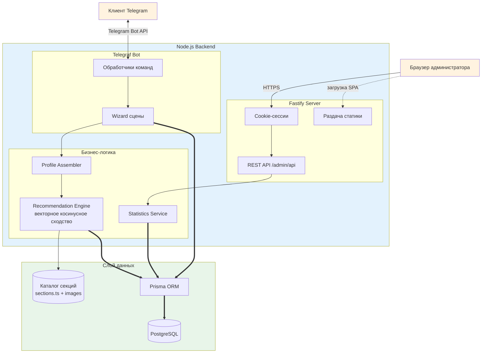
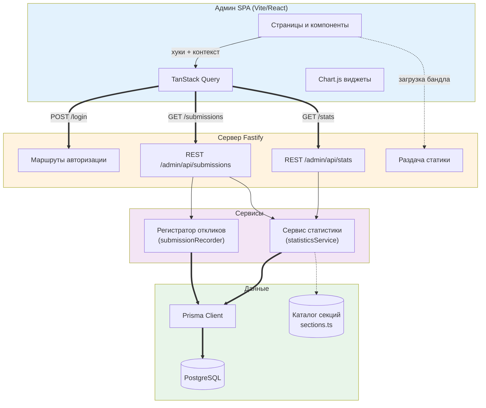
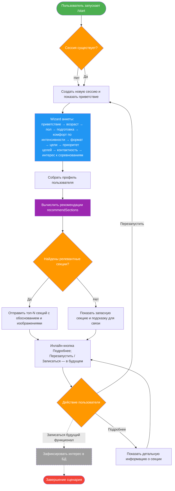
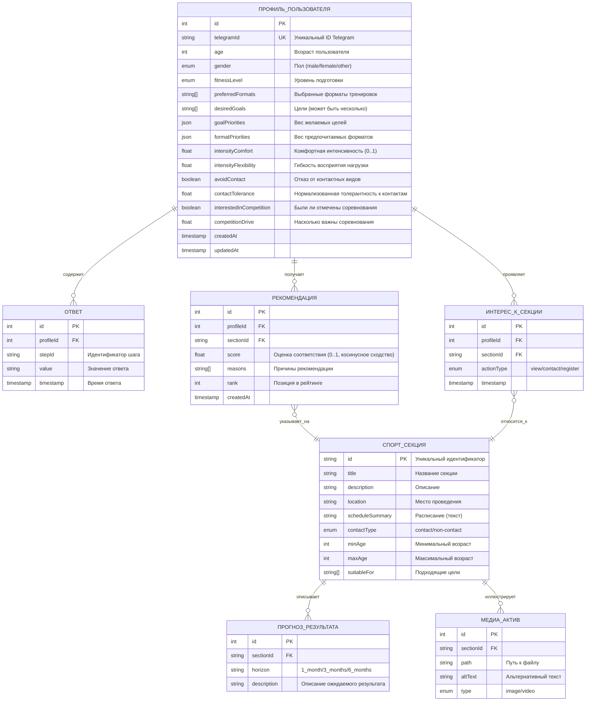

# Архитектура

<!-- markdownlint-disable MD033 -->

## Обзор

Проект объединяет Telegram-бота и веб-панель администратора, которые работают поверх единого Fastify-приложения и используют общую бизнес-логику и базу данных. Разделы ниже содержат детализированные диаграммы и описания, вынесенные из основного README ради лучшей навигации.

> ℹ️ **Совет:** диаграммы свёрнуты по умолчанию. Нажмите «Развернуть диаграмму», чтобы увидеть схему целиком и сопроводительные пояснения.

---

## Логическая архитектура решения

Развернуть диаграмму

**Ключевые связи:**

- Telegram-бот и веб-панель используют общие сервисы и инфраструктуру.
- Рекомендательный движок нормализует векторы профиля и секций, считает косинусное сходство и сохраняет лучшие результаты через Prisma.
- Статистика и список анкет обслуживаются REST API, защищённым cookie-сессиями и CSRF.

---

## Архитектура веб-панели

Развернуть диаграмму

**Примечания:**

- SPA общается с API через защищённые cookie-сессии и CSRF-токены.
- Fastify агрегирует статистику и отдаёт статические файлы Vite-сборки.

---

## Процесс работы чат-бота

Развернуть диаграмму

**Алгоритм:** после запуска сцены бот собирает профиль, вычисляет рекомендации, выдаёт карточки и предлагает действия через инлайн-кнопки.

---

## Модель данных

Развернуть диаграмму

**Что важно:** модель описывает профили, ответы и рекомендации, а также реакции пользователей на секции. Секции сопровождаются медиа и прогнозами результата.

---

## Связанные материалы

- Основной обзор читайте в разделе «4. Архитектура» главного README.
- Описание базы данных вынесено в `docs/DATABASE.md`.
- Подробности развёртывания и конфигурации — в `docs/DEPLOYMENT.md`.
