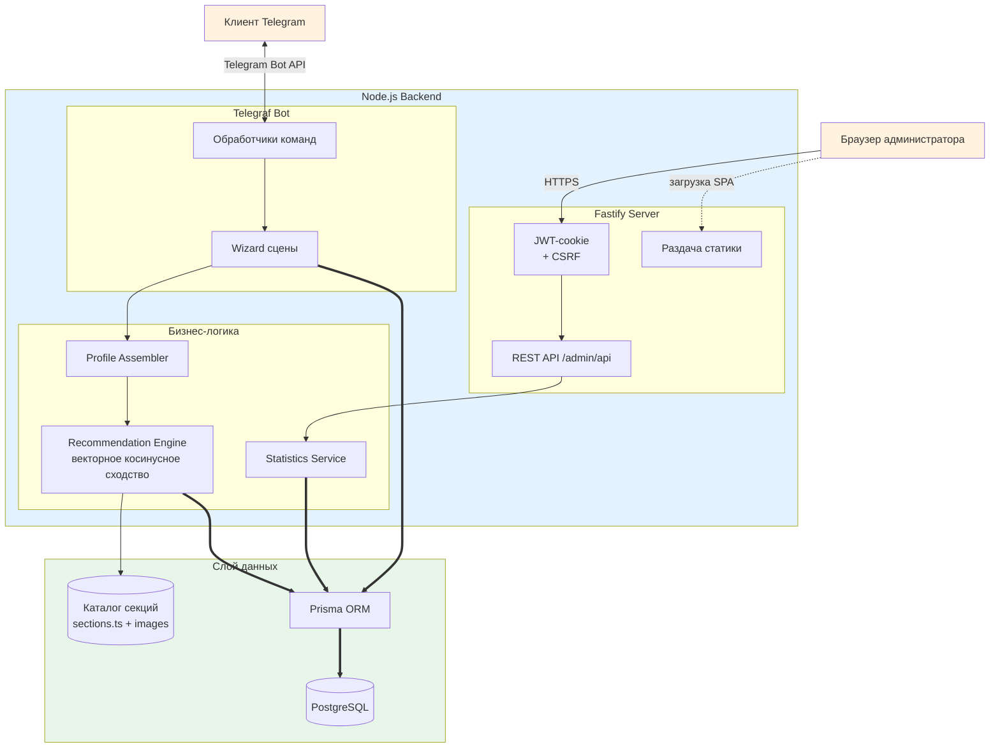

# Архитектура

<!-- markdownlint-disable MD033 -->

## Обзор

Проект объединяет Telegram-бота и веб-панель администратора, которые запускаются в одном Node.js процессе: Fastify обслуживает API и статику, а Telegraf работает как отдельный бот-инстанс, разделяющий те же сервисы и базу данных. Разделы ниже содержат детализированные диаграммы и описания, вынесенные из основного README ради лучшей навигации.

> ℹ️ **Совет:** диаграммы свёрнуты по умолчанию. Нажмите «Развернуть диаграмму», чтобы увидеть схему целиком и сопроводительные пояснения.

---

## Логическая архитектура решения

<details>
<summary>Развернуть диаграмму</summary>



**Ключевые связи:**

- Telegram-бот и веб-панель используют общие сервисы и инфраструктуру.
- Рекомендательный движок нормализует векторы профиля и секций, считает косинусное сходство и сохраняет лучшие результаты через Prisma.
- Статистика и список анкет обслуживаются REST API, защищённым httpOnly JWT-cookie и double-submit CSRF (login/logout).

</details>

---

## Архитектура веб-панели

<details>
<summary>Развернуть диаграмму</summary>


**Примечания:**

- SPA общается с API через httpOnly JWT-cookie; double-submit CSRF проверяется на входе/выходе и других мутациях.
- Fastify агрегирует статистику и отдаёт статические файлы Vite-сборки.

</details>

---

## Процесс работы чат-бота

<details>
<summary>Развернуть диаграмму</summary>


**Алгоритм:** после запуска сцены бот собирает профиль, вычисляет рекомендации, выдаёт карточки и предлагает действия через инлайн-кнопки. Шаг `RecordInterest` на диаграмме помечен пунктиром, потому что логирование интереса пока не реализовано и рассматривается как будущая доработка.

</details>

---

## Модель данных

<details>
<summary>Развернуть диаграмму</summary>

```mermaid
erDiagram
   SURVEY_SUBMISSION ||--o{ RECOMMENDATION_SNAPSHOT : "содержит"
   RECOMMENDATION_SNAPSHOT }o--|| SPORT_SECTION : "указывает_на"

   SURVEY_SUBMISSION {
      string id PK
      string telegramUserId "опциональный ID пользователя"
      string chatId "опциональный chat id"
      int age
      string gender
      string fitnessLevel
      string[] preferredFormats
      string[] desiredGoals
      boolean avoidContact
      boolean interestedInCompetition
      string aiSummary? "опциональное AI-пояснение"
      timestamp createdAt
   }

   RECOMMENDATION_SNAPSHOT {
      string id PK
      string submissionId FK
      string sectionId
      string sectionName
      float score
      int rank
      json reasons
      timestamp createdAt
   }

   SPORT_SECTION {
      string id PK
      string title
      string summary
      string format
      string contactLevel
      string intensity
      string[] focus
   }
```

**Что важно:** в текущей версии БД сохраняет только агрегированную анкету и снимки рекомендаций, а данные секций подгружаются из статического каталога `src/data/sections.ts`; таблицы с покомпонентными ответами и событиями интереса остаются в дорожной карте.

</details>

---

## Связанные материалы

- Основной обзор читайте в разделе «4. Архитектура» главного README.
- Описание базы данных вынесено в `docs/DATABASE.md`.
- Подробности развёртывания и конфигурации — в `docs/DEPLOYMENT.md`.
