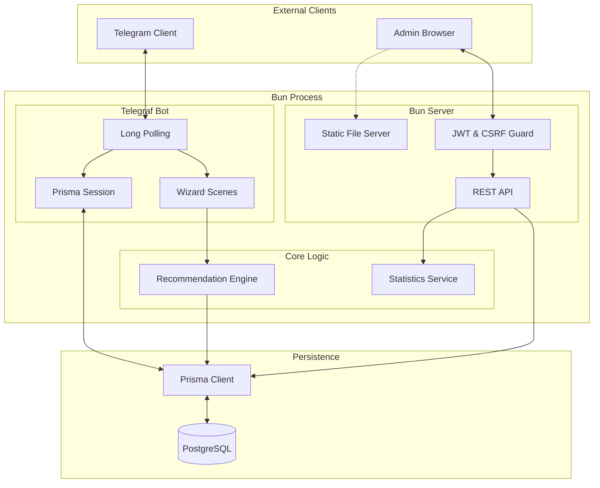

# Техническое описание проекта

## 1. Аннотация

Репозиторий [kotru21/bsuir](https://github.com/kotru21/bsuir) представляет собой прототип цифровой платформы маркетинга спортивных услуг БГУИР. Решение объединяет Telegram-бота (Bun 1+, Telegraf) и административную веб-панель (React 19.2, Vite), работающих в едином контуре.

Ключевая особенность системы — гибридная архитектура, где один Bun-процесс обслуживает и long-polling бота, и REST API для админки через Bun.serve. Это упрощает деплой и обеспечивает общую область памяти для кэширования, при этом данные персистируются в PostgreSQL через Prisma ORM.

## 2. Структура проекта

Проект организован как монорепозиторий с четким разделением на домены.

```text
.
├── admin/                  # Подсистема административной панели
│   ├── web/                # Frontend (React SPA)
│   │   ├── src/
│   │   │   ├── api/        # Клиент REST API (fetch wrapper)
│   │   │   ├── auth/       # Контекст авторизации (JWT, CSRF)
│   │   │   ├── charts/     # Визуализация (Chart.js + TanStack Query)
│   │   │   ├── components/ # UI-кит (Tailwind)
│   │   │   └── pages/      # Страницы (Dashboard, Submissions)
│   │   └── vite.config.ts  # Конфигурация сборки Vite
│   ├── config.ts           # Конфигурация бэкенда админки
│   ├── server.ts           # Bun.serve HTTP сервер
│   └── routes/             # REST API эндпоинты
│       ├── auth.ts         # Логин/логаут, CSRF
│       ├── sections.ts     # CRUD секций
│       ├── stats.ts        # Аналитика
│       └── submissions.ts  # Просмотр анкет
├── src/
│   ├── bot/                # Подсистема Telegram-бота
│   │   ├── handlers/       # Обработчики команд и действий
│   │   ├── scenes/         # Wizard-сцены (onboarding)
│   │   ├── services/       # Презентеры и хелперы бота
│   │   ├── app.ts          # Конфигурация Telegraf
│   │   └── prismaSession.ts# Middleware сессий (PostgreSQL)
│   ├── data/               # Данные
│   │   ├── images/         # Загруженные изображения
│   │   └── sections.ts     # Seed-данные каталога
│   ├── domain/             # Бизнес-правила и константы
│   ├── infrastructure/     # Инфраструктурный слой (Prisma)
│   ├── services/           # Общие сервисы
│   │   ├── aiSummary.ts    # Интеграция с LLM
│   │   ├── profileAssembler.ts # Сборка профиля пользователя
│   │   └── submissionRecorder.ts # Сохранение результатов
│   ├── index.ts            # Точка входа (Bootstrapping)
│   ├── recommendation.ts   # Движок рекомендаций
│   └── types.ts            # Общие TypeScript типы
├── prisma/                 # Схема БД и миграции
└── docs/                   # Документация
```

## 3. Архитектура системы

### 3.1. Высокоуровневая схема

Система работает как единый сервис, объединяющий два интерфейса доступа к общим данным.



### 3.2. Поток данных (Data Flow)

1. **Сбор данных (Bot):** Пользователь проходит шаги сцены `onboarding`. Промежуточные ответы сохраняются в таблице `Session` через `prismaSession` middleware.
2. **Обработка:** По завершении анкеты `profileAssembler` формирует `UserProfile`.
3. **Рекомендация:** `recommendation.ts` запрашивает секции из БД (с кэшированием), строит векторы и вычисляет косинусное сходство.
4. **Сохранение:** Результат (анкета + топ рекомендаций) сохраняется в `SurveySubmission` и `RecommendationSnapshot`.
5. **Аналитика (Admin):** Админ-панель запрашивает агрегированные данные через REST API. Bun.serve обрабатывает запросы и делегирует агрегаты Prisma (GROUP BY, COUNT).

## 4. Детальный анализ компонентов

### 4.1. Telegram Бот

Бот построен на библиотеке `Telegraf` и использует концепцию сцен (Scenes) для линейных диалогов.

#### Конфигурация и Middleware

Файл [`src/bot/app.ts`](https://github.com/kotru21/bsuir/blob/main/src/bot/app.ts) отвечает за сборку бота: подключение сессий, сцен и регистрацию обработчиков.

```typescript
// src/bot/app.ts
export function configureBot(bot: Telegraf<RecommendationContext>): void {
  const stage = new Scenes.Stage<RecommendationContext>([onboardingScene]);
  bot.use(prismaSession()); // Подключение БД-сессий
  bot.use(stage.middleware()); // Подключение сцен

  registerCoreCommands(bot); // /start, /restart
  registerSectionHandlers(bot); // Обработка кнопок секций
  registerRecommendationCarouselHandlers(bot); // Листание рекомендаций
  // ...
}
```

#### Обработчики команд

Основные команды (`/start`, `/restart`) регистрируются в [`src/bot/handlers/commands.ts`](https://github.com/kotru21/bsuir/blob/main/src/bot/handlers/commands.ts). Они отвечают за вход в сцену анкетирования.

```typescript
// src/bot/handlers/commands.ts
export function registerCoreCommands(
  bot: Telegraf<RecommendationContext>
): void {
  bot.start(
    wrapBotHandler(async (ctx) => {
      await ctx.scene.enter("onboarding");
    })
  );
  // ...
}
```

#### Сцены (Scenes)

Основная логика взаимодействия сосредоточена в [`src/bot/scenes/onboarding.ts`](https://github.com/kotru21/bsuir/blob/main/src/bot/scenes/onboarding.ts). Используется `WizardScene` для пошагового сбора данных.

**Шаги сцены:**

1. **introStep:** Приветствие.
2. **ageSelectionStep:** Выбор возраста (клавиатура с инкрементом/декрементом).
3. **genderStep:** Выбор пола.
4. **fitnessStep:** Оценка уровня подготовки.
5. **intensityComfortStep:** Предпочтительная интенсивность.
6. **formatStep:** Формат тренировок (группа/индивидуально).
7. **goalStep:** Выбор целей (похудение, сила, гибкость и т.д.).
8. **goalPriorityStep:** Приоритизация выбранных целей.
9. **contactPreferenceStep:** Отношение к контактным видам спорта.
10. **competitionInterestStep:** Интерес к соревнованиям.

Каждый шаг обернут в `wrapSceneStep` для безопасной обработки ошибок.

#### Клавиатуры и Callback Data

Все клавиатуры генерируются в [`src/bot/keyboards.ts`](https://github.com/kotru21/bsuir/blob/main/src/bot/keyboards.ts). Используется строгий формат `callback_data`: `prefix:payload`.

Примеры:

- **age:+1** — увеличить возраст на 1.
- **gender:male** — выбрать мужской пол.
- **rec:section_id** — показать детали рекомендации.

#### Управление сессиями (Session Management)

Для персистентности данных между перезапусками сервера используется кастомный middleware `prismaSession` ([`src/bot/prismaSession.ts`](https://github.com/kotru21/bsuir/blob/main/src/bot/prismaSession.ts)).

**Алгоритм работы middleware:**

1. **Load:** При каждом обновлении (update) извлекает сессию из таблицы `Session` по ключу `chatId`.
2. **Inject:** Десериализует JSON и помещает в `ctx.session`.
3. **Next:** Передает управление дальше по цепочке middleware.
4. **Save:** После обработки обновления сериализует `ctx.session` и выполняет `upsert` в БД.

```typescript
// src/bot/prismaSession.ts (упрощено)
export function prismaSession(): Middleware<RecommendationContext> {
  return async (ctx, next) => {
    const key = ctx.chat?.id?.toString();
    // Загрузка сессии из БД
    const record = await prisma.session.findUnique({ where: { key } });
    ctx.session = record ? JSON.parse(record.value) : {};

    await next();

    // Сохранение сессии после обработки
    await prisma.session.upsert({
      where: { key },
      update: { value: JSON.stringify(ctx.session) },
      create: { key, value: JSON.stringify(ctx.session) },
    });
  };
}
```

### 4.2. Админ-бэкенд (Bun.serve)

Bun.serve выбран за счёт отсутствия внешних зависимостей, высокой производительности и возможности держать бота с API в одном процессе.

#### Инициализация сервера

Файл [`src/admin/server.ts`](https://github.com/kotru21/bsuir/blob/main/src/admin/server.ts) поднимает Bun.serve, реализует минимальный роутер, раздаёт статику Vite и регистрирует REST эндпоинты.

```typescript
// src/admin/server.ts
export async function buildAdminServer(
  options: BuildAdminServerOptions
): Promise<AdminServer> {
  const resolvedConfig = await resolveAdminConfig(options.config);
  return new BunAdminServer({
    config: resolvedConfig,
    rootDir: options.rootDir ?? process.cwd(),
  });
}
```

#### Аутентификация и Безопасность

Реализована схема на основе JWT и Double Submit Cookie для защиты от CSRF.

- **JWT:** Хранится в `httpOnly` cookie. Подписывается встроенной реализацией HS256 (crypto.createHmac) без внешних зависимостей.
- **CSRF:** Токен генерируется сервером и отправляется в `httpOnly: false` cookie. Клиент (React) должен прочитать этот cookie и передать его значение в заголовке `x-csrf-token` при каждом мутирующем запросе (POST, PUT, DELETE).
- **Валидация:** Все входные данные валидируются с помощью библиотеки `zod`.

#### API Эндпоинты

Все маршруты находятся в [`src/admin/routes/`](https://github.com/kotru21/bsuir/tree/main/src/admin/routes).

- `GET /api/stats/overview`: Общая статистика (всего анкет, топ секций).
- `GET /api/stats/demographics`: Распределение по полу, возрасту и уровню подготовки.
- `GET /api/stats/timeline`: Динамика заполнения анкет по дням.
- `GET /api/sections`: CRUD для спортивных секций.
- `POST /api/upload`: Загрузка изображений (multipart/form-data).

### 4.3. Админ-фронтенд (React)

Frontend реализован как Single Page Application (SPA) на базе React 19.2 и Vite.

#### Технологический стек

- **Core:** React 19.2, TypeScript.
- **Build:** Vite.
- **Routing:** `react-router-dom`.
- **Styling:** Tailwind CSS.
- **Visualization:** Chart.js (через `react-chartjs-2`).
- **State Management:** React Context (для авторизации), локальный стейт компонентов.

#### Архитектура приложения

Приложение обернуто в несколько провайдеров:

1. **GlobalErrorBoundary:** Перехват критических ошибок рендеринга.
2. **AuthProvider:** Управление состоянием сессии и CSRF-токенами.
3. **Router:** Маршрутизация.

**Маршрутизация:**
Используется компонент `ProtectedRoute` для защиты приватных маршрутов. Если пользователь не авторизован, происходит редирект на `/login`.

#### Взаимодействие с API

Для запросов к бэкенду используется утилита `apiFetch` ([`src/api/client.ts`](https://github.com/kotru21/bsuir/blob/main/admin/web/src/api/client.ts)), которая:

- **Headers:** Автоматически добавляет заголовок `Content-Type: application/json`.
- **Security:** Внедряет CSRF-токен в заголовки мутирующих запросов.
- **Errors:** Обрабатывает ошибки HTTP (выбрасывает типизированный `ApiError`).
- **Timeout:** Управляет таймаутами запросов.

#### Оптимизация производительности

Используется Code Splitting для тяжелых компонентов (графики). Они загружаются лениво через `React.lazy` и `Suspense`.

```tsx
// Пример ленивой загрузки графика
const GenderDistributionChart = lazy(() =>
  import("../components/GenderDistributionChart").then((m) => ({
    default: m.GenderDistributionChart,
  }))
);
```

### 4.4. Движок рекомендаций

Ядро системы — векторное сравнение профиля пользователя и характеристик секции. Логика находится в [`src/recommendation.ts`](https://github.com/kotru21/bsuir/blob/main/src/recommendation.ts).

#### Кэширование

Секции загружаются из БД и кэшируются в памяти на 5 минут (`CACHE_TTL_MS = 300000`). Это снижает нагрузку на БД при массовых запросах.

#### Векторизация

Профиль пользователя и каждая секция преобразуются в многомерные векторы `SimilarityVector`.

**Измерения вектора:**

1. **Goals (Цели):** Вес каждой цели (например, `goal:weight_loss`) определяется приоритетом пользователя.
2. **Formats (Форматы):** Предпочтения по формату тренировок (группа/соло).
3. **Intensity (Интенсивность):** Числовое значение (0 - low, 0.5 - medium, 1 - high).
4. **Contact (Контактность):** Уровень физического контакта.

#### Алгоритм расчета

1. **Построение векторов:** Формируются векторы пользователя $V_u$ и секции $V_s$.
2. **Нормализация:** Векторы приводятся к единичной длине.
3. **Косинусное сходство:** Вычисляется скалярное произведение:
   $$ Similarity = \frac{V_u \cdot V_s}{||V_u|| \times ||V_s||} $$
4. **Фильтрация:** Исключаются секции, не подходящие по жестким критериям (например, возрастные ограничения).

```typescript
// Пример весов интенсивности
const fitnessScalar: Record<FitnessLevel, number> = {
  low: 0,
  medium: 0.5,
  high: 1,
};
```

### 4.5. Сервисный слой

#### Сборка профиля (Profile Assembler)

[`src/services/profileAssembler.ts`](https://github.com/kotru21/bsuir/blob/main/src/services/profileAssembler.ts) преобразует "сырые" данные из сессии (Draft) в валидный `UserProfile`.

```typescript
// src/services/profileAssembler.ts
export function assembleUserProfile(draft: ProfileDraft): UserProfile {
  return {
    age: draft.age ?? AGE_DEFAULT,
    gender: draft.gender ?? "unspecified",
    // ... маппинг остальных полей
  };
}
```

#### Сохранение результатов (Submission Recorder)

[`src/services/submissionRecorder.ts`](https://github.com/kotru21/bsuir/blob/main/src/services/submissionRecorder.ts) отвечает за сохранение результатов анкетирования в базу данных. Он создает запись `SurveySubmission` и связанные `RecommendationSnapshot`.

```typescript
// src/services/submissionRecorder.ts
export async function recordSubmission(
  payload: SubmissionRecordPayload
): Promise<void> {
  // ...
  await prisma.surveySubmission.create({
    data: {
      // ... данные профиля
      recommendations: {
        create: recommendationData, // ... топ-5 рекомендаций
      },
    },
  });
}
```

## 5. Модель данных (Prisma Schema)

Схема БД спроектирована для поддержки как операционных данных (сессии, секции), так и аналитических (анкеты).

### Основные модели

#### SurveySubmission

Хранит результаты заполненной анкеты. Используется для аналитики.

```prisma
model SurveySubmission {
  id                       String                     @id @default(cuid())
  telegramUserId           String?
  chatId                   String?
  age                      Int
  gender                   String
  fitnessLevel             String
  preferredFormats         String[]
  desiredGoals             String[]
  avoidContact             Boolean
  interestedInCompetition  Boolean
  aiSummary                String?
  createdAt                DateTime                   @default(now())
  recommendations          RecommendationSnapshot[]

  @@index([createdAt])
  @@index([gender])
  @@index([fitnessLevel])
}
```

#### RecommendationSnapshot

Хранит "снимок" выданных рекомендаций для каждой анкеты. Позволяет анализировать качество работы алгоритма.

```prisma
model RecommendationSnapshot {
  id            String           @id @default(cuid())
  submission    SurveySubmission @relation(fields: [submissionId], references: [id], onDelete: Cascade)
  submissionId  String
  sectionId     String
  sectionName   String
  score         Float
  rank          Int
  reasons       Json?            // Объяснение, почему секция была рекомендована
  createdAt     DateTime         @default(now())

  @@index([submissionId, rank])
  @@index([sectionId])
}
```

#### SportSection

Каталог секций. Поле `similarityVector` хранит прекалькулированный вектор характеристик для ускорения поиска.

```prisma
model SportSection {
  id               String   @id @default(cuid())
  title            String
  description      String
  // ... другие поля ...
  similarityVector Json     // Векторное представление для алгоритма
}
```

## 6. Разработка и эксплуатация

### 6.1. Конфигурация

Система настраивается через переменные окружения (файл `.env`).

| Переменная         | Описание                           | Обязательно | Значение по умолчанию |
| :----------------- | :--------------------------------- | :---------- | :-------------------- |
| `BOT_TOKEN`        | Токен Telegram бота                | Да          | -                     |
| `DATABASE_URL`     | Строка подключения к PostgreSQL    | Да          | -                     |
| `ADMIN_USERNAME`   | Логин администратора               | Нет         | `admin`               |
| `ADMIN_PASSWORD`   | Пароль администратора (plain text) | Да\*        | -                     |
| `ADMIN_JWT_SECRET` | Секрет для подписи JWT             | Да          | -                     |
| `OPENAI_API_KEY`   | Ключ API OpenAI (для саммари)      | Нет         | -                     |

_\* Требуется либо `ADMIN_PASSWORD`, либо `ADMIN_PASSWORD_HASH`._

### 6.2. Запуск

Точка входа [`src/index.ts`](https://github.com/kotru21/bsuir/blob/main/src/index.ts) оркестрирует запуск всех подсистем.

1. **Init:** Загрузка переменных окружения.
2. **DB:** Подключение Prisma Client.
3. **Admin:** Запуск Bun.serve на порту 3000.
4. **Bot:** Запуск Telegraf в режиме Long Polling.

### 6.3. Тестирование

Проект использует встроенный раннер `bun test` для модульного и интеграционного тестирования.

**Запуск тестов:**

```bash
bun run test
```

**Покрытие:**

- **Unit:** Логика рекомендаций (`src/recommendation.test.ts`), утилиты.
- **Integration:** Сценарии бота (`test/onboarding.test.ts`), API админки.
- **Snapshot:** Рендеринг React-компонентов.

**Обработка ошибок:**

Глобальные перехватчики `unhandledRejection` и `uncaughtException` предотвращают падение процесса при некритичных ошибках.

## 7. Перспективы развития

Текущая архитектура закладывает фундамент для масштабирования:

1. **Очереди:** Вынос тяжелых задач (генерация AI-ответов, рассылка уведомлений) в фоновые воркеры (например, BullMQ + Redis).
2. **ML:** Замена эвристического векторного движка на обучаемую модель ранжирования (Learning to Rank) на основе накопленных данных в `RecommendationSnapshot`.
3. **CDN:** Вынос статики и изображений в S3-совместимое хранилище (MinIO, AWS S3).
4. **Web App:** Интеграция Telegram Mini Apps для замены текстового Wizard-интерфейса на полноценный Web UI внутри бота.
